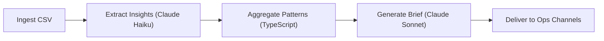

# OpenClaw Multi-Agent Fleet: Autonomous E-Commerce Ops


## The Mission

This project is a production-oriented multi-agent automation fleet for an orthopedic footwear DTC brand, built to continuously convert operational signals into action across three core domains: Voice of Customer research, Competitor Intelligence, and Supply Chain Monitoring.

## Architecture



- TypeScript
- OpenClaw Pattern
- File-based RAG
- Zod Schema Validation

## Agent Roster

- **VoC Researcher** (`agents/voc_researcher/`): transforms raw reviews into structured insights and conversion-ready creative briefs.
- **Competitor Spy** (`agents/competitor_spy/`): tracks emerging ad angles and identifies net-new creative threats via memory-aware delta detection.
- **Supply Watchdog** (`agents/supply_chain_watch/`): computes inventory risk from sales velocity and triggers ad-spend guardrails for low-stock SKUs.

## Key Innovations

- **Cost-Effective Model Routing (Haiku vs Sonnet)**: low-cost extraction/analysis with premium synthesis only where strategic value is highest.
- **Self-Healing JSON Parsers**: centralized LLM client retries with schema feedback when malformed output is returned.
- **Conflict Resolution Logic**: manager-layer synthesis detects cross-agent contradictions (for example, growth push vs low stock) and escalates critical risks.

## Quick Start

```bash
npm install
cp .env.example .env
npm run verify
```

## Command Reference

| Command | Purpose |
|---|---|
| `npm run verify` | Verify environment readiness (filesystem + API + verification log). |
| `npm run extract:insights` | Run VoC extraction pipeline. |
| `npm run generate:brief` | Generate latest VoC creative brief from aggregated insights. |
| `npm run spy:analyze` | Analyze competitor ad samples with structured output. |
| `npm run spy:detect` | Detect new competitor angles and update spy memory. |
| `npm run spy:report` | Produce `reports/daily_competitor.md`. |
| `npm run supply:check` | Generate inventory risk report and ad-pause guidance. |
| `npm run morning:brief` | Run orchestrator and synthesize daily executive briefing. |
| `npm run status` | Show 24-hour run health, success rate, and model cost. |
